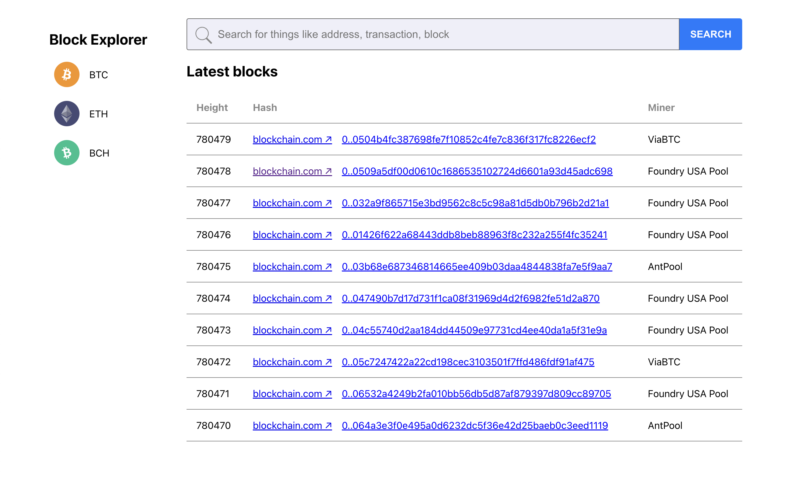
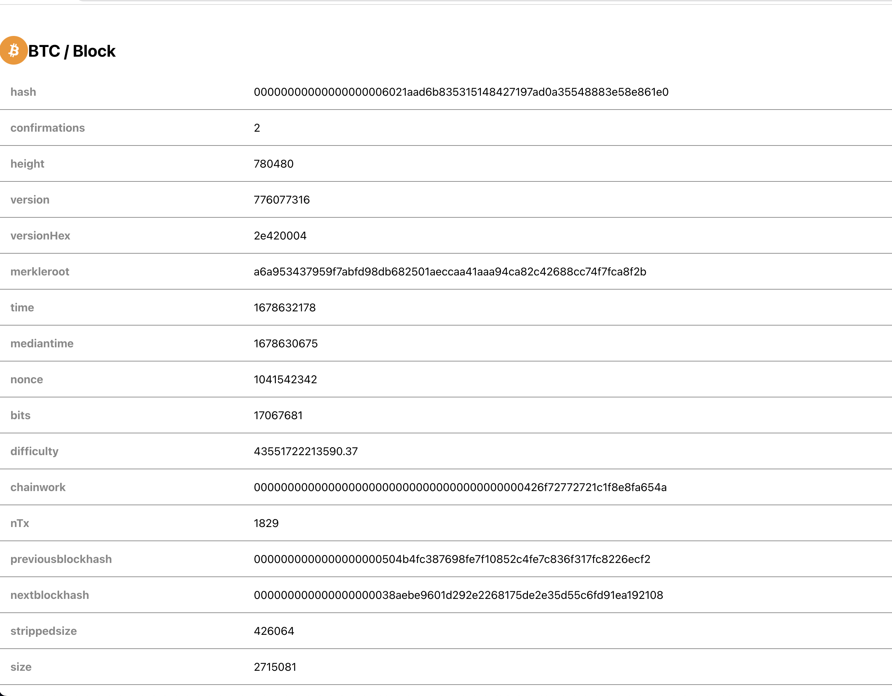

# Getting Started with Create React App

This project was bootstrapped with [Create React App](https://github.com/facebook/create-react-app).

The project is hosted on Vercel here [https://blockchain-bilo.vercel.app/](https://blockchain-bilo.vercel.app/).

## Quickstart

- `git clone {repo_url}`
- `cd ./blockchain`
- `yarn`
- `yarn start`

## Available Scripts

| script           | description                                                             |
| :--------------- | :---------------------------------------------------------------------- |
| `yarn start`     | Launches the webapp on [https://localhost:3000](https://localhost:3000) |
| `yarn storybook` | Launches Storybook on [https://localhost:6006](https://localhost:6006)  |
| `yarn chromatic` | Publishes a build on Chromatic                                          |
| `yarn cypress`   | Runs automated UI (e2e) testing                                         |
| `yarn test`      | Runs unit and component tests with interactive CLI                      |
| `yarn test:ci`   | Runs once-off with a coverage report (suitable for CI pipeline)         |

## Preview

### Blockchain webapp

### Storybook

To explore and expand on the component library used in this project, run `yarn storybook`.

This will launch an implementation of Storybook for this project on [localhost:6006](https://localhost:6006).

